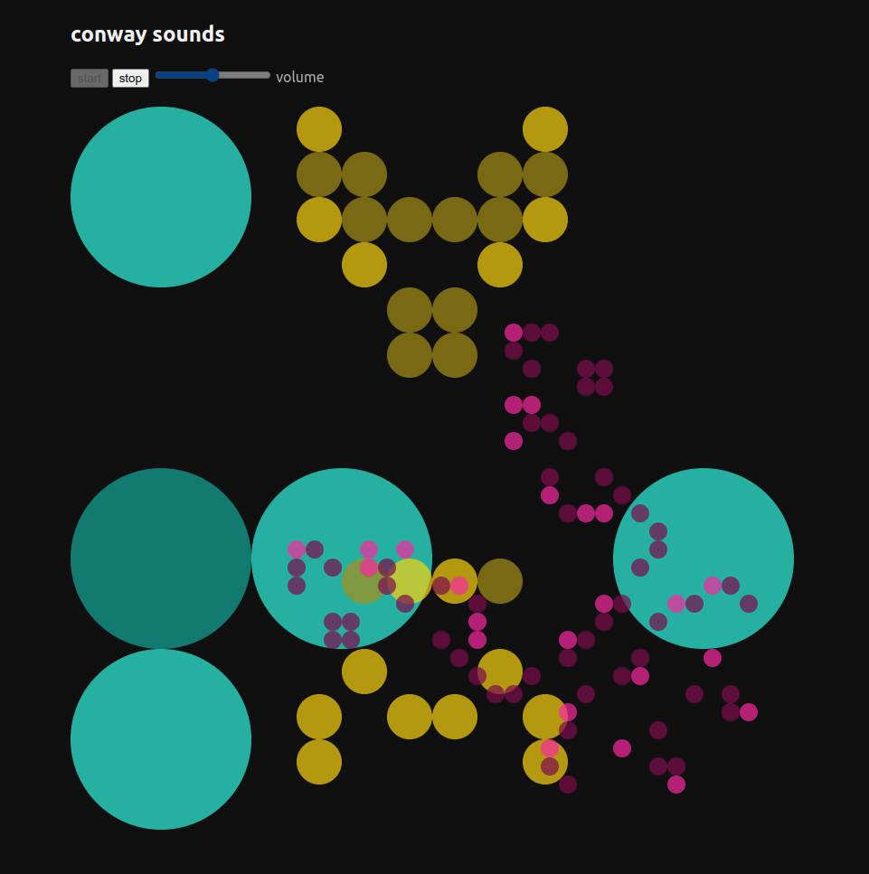

# Conway's Game of Life Sonification 

Learning Clojurescript and experimenting with the Web Audio API. 

Look and listen at https://josephdumont.com/conway/

This is still in progress, and only the first game (of three overlapping games) is sonified with a [Tonality Lattice](https://en.wikipedia.org/wiki/Lattice_(music)) of minor sevenths and major thirds. 

